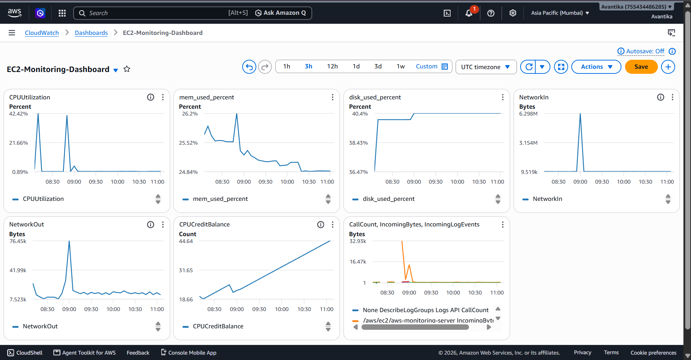
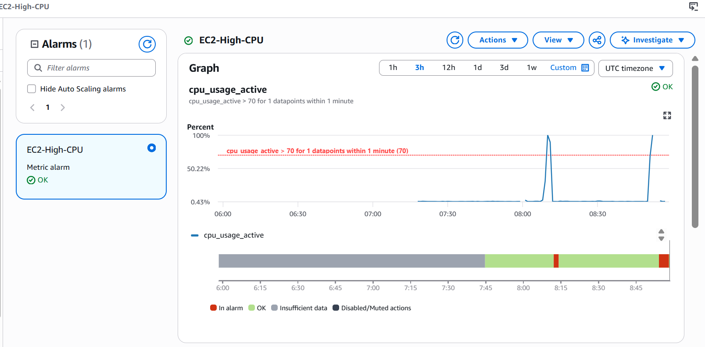
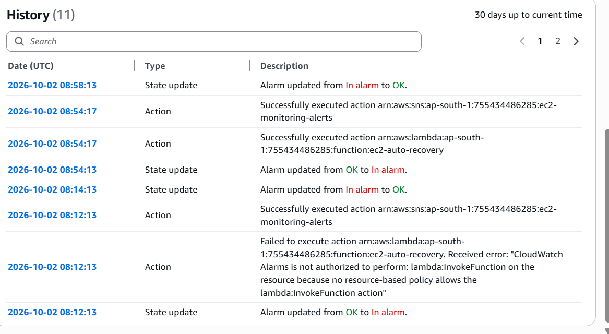
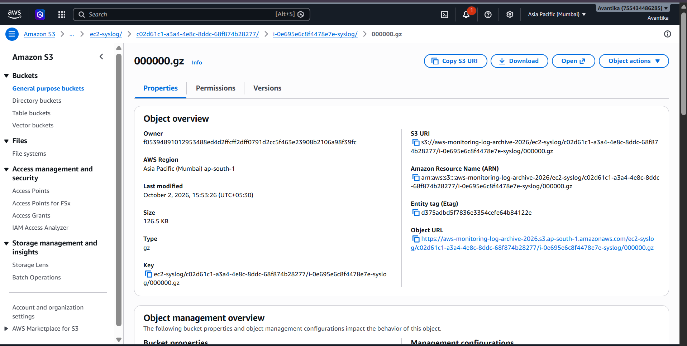
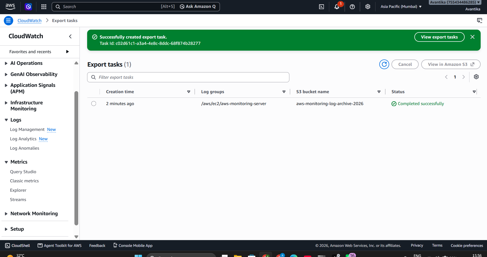

# AWS EC2 Monitoring, Alerting & Automated Recovery

A hands-on AWS project that monitors an EC2 instance, sends email alerts, automatically recovers the instance on high CPU, and archives logs to S3 for long-term retention.

## Architecture

```
EC2
 ↓
CloudWatch Agent
 ↓
CloudWatch Metrics
 ↓
CloudWatch Alarm (CPU > 70%)
 ├── SNS → Email Alert
 └── Lambda → EC2 Reboot

CloudWatch Logs → S3 (export task, long-term archive)
```


## AWS Services Used

- Amazon EC2
- Amazon CloudWatch (Metrics, Alarms, Logs)
- CloudWatch Agent
- Amazon SNS
- AWS Lambda
- AWS IAM
- Amazon S3

## Project Workflow

1. An Ubuntu EC2 instance is launched in `ap-south-1`.
2. CloudWatch Agent is installed (via the `.deb` package).
3. The agent sends CPU, memory and disk metrics, plus syslog, to CloudWatch.
4. A CloudWatch Alarm monitors CPU utilization.
5. If CPU goes above 70%, the alarm enters `In alarm`.
6. SNS sends an email notification.
7. Lambda is invoked and reboots the EC2 instance.

## Monitoring
### CloudWatch Dashboard

Custom CloudWatch namespace: `AWS/EC2/MonitoringProject`

Metrics collected: CPU usage, memory used %, disk used % (`/`).
Logs collected: `/var/log/syslog` → log group `/aws/ec2/aws-monitoring-server`.

Agent config: [`cloudwatch/agent-config.json`](cloudwatch/agent-config.json)

## Alarms

| Alarm | Condition | Action |
|---|---|---|
| EC2-High-CPU | CPU > 70% (1 min, 1 of 1) | SNS email + Lambda reboot |
| EC2-High-Memory | Memory > 80% (2 of 2) | SNS email only |
| EC2-High-Disk | Disk > 80% (2 of 2) | SNS email only |

Only the CPU alarm triggers an automatic reboot. Reboot does not fix memory leaks or a full disk, so those alarms notify only.

## Lambda Auto Recovery

The `ec2-auto-recovery` function (Python 3.13, `boto3`) reboots the instance.

- Instance ID is passed via the `INSTANCE_ID` Lambda environment variable (nothing hardcoded).
- Structured JSON logging and error handling.
- IAM follows least privilege: only `ec2:RebootInstances` on the monitored instance (no EC2 full access).

Code: [`lambda/ec2_auto_recovery.py`](lambda/ec2_auto_recovery.py)

## Long-Term Log Archival (Amazon S3)

Logs from `/aws/ec2/aws-monitoring-server` are archived to a private S3 bucket using a CloudWatch Logs export task.

- Bucket is private (Block Public Access ON, SSE-S3 encryption).
- Bucket policy allows only the CloudWatch Logs service, restricted with `aws:SourceAccount` and `aws:SourceArn`.
- Export is a manual, on-demand export task (not continuous streaming).
- S3 is not part of alarming or recovery. The alarm → SNS → Lambda flow is unchanged.

Exported objects appear under `ec2-syslog/<task-id>/<instance-id>/syslog/`.

Policy: [`s3/bucket-policy.json`](s3/bucket-policy.json) (account ID replaced with a placeholder)

## Testing

CPU load was generated with:

```bash
stress-ng --cpu 2 --timeout 120s
```

Result: CPU reached ~100%, the alarm triggered, the SNS email was received, Lambda ran, and EC2 rebooted and returned to `running`.

## Screenshots

### CPU usage during stress test


### Alarm history


### S3 log archive


### Export task completed


## Repository Structure

```text
aws-ec2-monitoring-auto-recovery/
├── README.md
├── architecture/
│   └── aws-architecture.png
├── cloudwatch/
│   └── agent-config.json
├── lambda/
│   └── ec2_auto_recovery.py
├── s3/
│   └── bucket-policy.json
└── screenshots/
```

## Security

- No AWS access keys or secret keys are stored in this repository.
- Account ID and instance-specific details are removed or blurred.
- Lambda uses a least-privilege IAM policy.
- S3 bucket is private and access is limited to CloudWatch Logs.

## Key Concepts Learned

- EC2 monitoring with the CloudWatch Agent
- CloudWatch custom metrics and alarms
- SNS notifications
- Lambda-based automated recovery
- IAM roles, resource-based policies and least privilege
- CloudWatch Logs export to S3

## Limitations / Future Work

- Log export to S3 is manual; continuous archival would need a subscription-based design.
- Infrastructure is created manually; Terraform is a planned upgrade.
